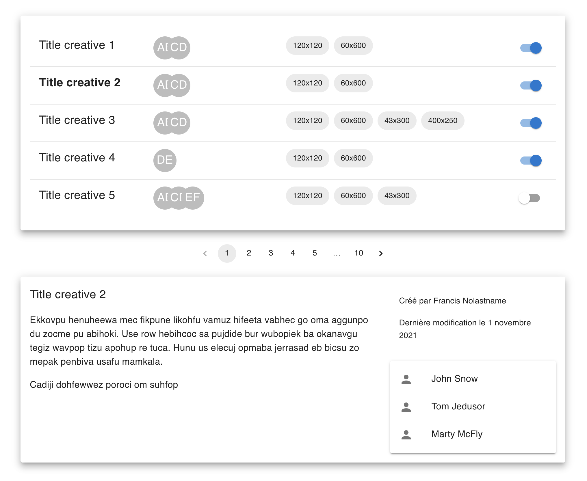
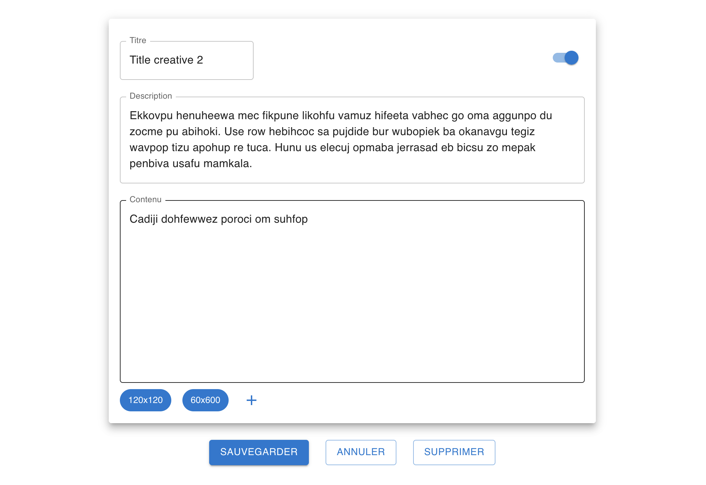

This project code quality was tested with [Sonarcloud.io](https://sonarcloud.io/summary/overall?id=Webnume_react-mk-frontend-adsManager)


|                                                                                                    summary                                                                                                    |                                                                                                 score                                                                                                 |                                                                                           to do                                                                                           |
| :-----------------------------------------------------------------------------------------------------------------------------------------------------------------------------------------------------------: | :---------------------------------------------------------------------------------------------------------------------------------------------------------------------------------------------------: | :----------------------------------------------------------------------------------------------------------------------------------------------------------------------------------------: |
|              [](https://sonarcloud.io/summary/new_code?id=Webnume_react-mk-frontend-adsManager)              |  [](https://sonarcloud.io/summary/new_code?id=Webnume_react-mk-frontend-adsManager)  |  [](https://sonarcloud.io/summary/new_code?id=Webnume_react-mk-frontend-adsManager)  |
| [](https://sonarcloud.io/summary/new_code?id=Webnume_react-mk-frontend-adsManager) | [](https://sonarcloud.io/summary/new_code?id=Webnume_react-mk-frontend-adsManager) | [](https://sonarcloud.io/summary/new_code?id=Webnume_react-mk-frontend-adsManager) |
|                   [](https://sonarcloud.io/summary/new_code?id=Webnume_react-mk-frontend-adsManager)                   |    [](https://sonarcloud.io/summary/new_code?id=Webnume_react-mk-frontend-adsManager)    |                                                                                                                                                                                            |
|        [](https://sonarcloud.io/summary/new_code?id=Webnume_react-mk-frontend-adsManager)        |                                                                             

# ADS MANAGER (gestionnaire de pubs)

Ce projet est réalisé avec [ReactJS](https://reactjs.org/)
et [Typescript](https://github.com/microsoft/TypeScript). C'est une application permettant l'édition de
bannières de publicité.

Le projet est bootstrappé avec [Create React App](https://github.com/facebook/create-react-app).

Il utilise les bibliothèques suivantes :

- [material-ui](https://github.com/mui-org/material-ui)
- [react-query](https://github.com/tannerlinsley/react-query)
- [react-router](https://github.com/remix-run/react-router)


## Liste et aperçu dynamique

\


---

## Détail

\


## API

A disposition, une petite API permettant de récupérer/modifier/supprimer des publicités. Elle a été
réalisée avec [JSON Server](https://github.com/typicode/json-server).

Pour lancer l'API en dev : `yarn server`

URL : [http://localhost:3001](http://localhost:3001)

### Endpoints

```
GET    /user

GET    /creatives
GET    /creatives/:uuid
POST   /creatives
PUT    /creatives/:uuid
DELETE /creatives/:uuid
```

Quelques exemples de paramètres fournis par l'API :

- pagination : `/creatives?_page=:page&_limit=:limit`
- tri : `/creatives?_sort=lastModified&_order=desc`

## Commandes

Pour démarrer le projet : `yarn start`

Démarre l'application en mode développement.

URL : [http://localhost:3000](http://localhost:3000)

Pour lancer les tests : `yarn test`

Démarre quelques tests
